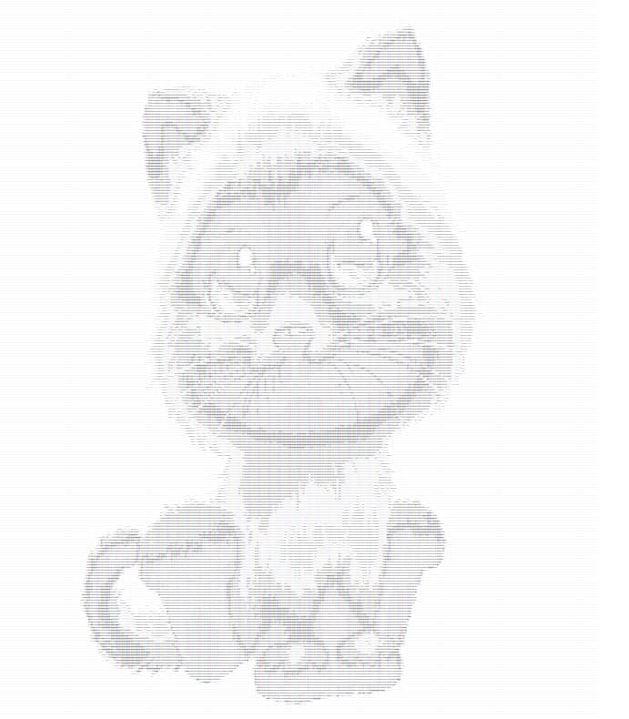

# Конвертер в текстовую графику


Данный проект представляет собой сервер, умеющий скачивать картинки по URL и конвертировать изображения в текстовую графику.


| Класс / Интерфейс      | Значение |
| ----------- | ----------- |
| `BadImageSizeException`      | Класс исключения, которое выбрасывается если соотношение сторон картирнки превышает допустимое       |
| `TextColorSchema / TextColorSchemaImpl`   | Интерфейс цветовой схемы и класс, который реализует этот интерфейс и в котором прописана формула расчета замены пикселя на символ        |
| `TextGraphicsConverter / TextGraphicsConverterImpl`   | Интерфейс конвертера картинок и класс, который реализует этот интерфейс и в котором прописана основная логика конвертации изображения: установка максимально-допустимого соотношения сторон, превращение цветного изображения в ЧБ, в зависимости от степени белого выбор символа из заранее подготовленного списка, а также построение изображения через StringBuilder|
| `GServer`   | Класс сервера, который берет в работу конвертер изображения       |
| `Main`   | Запуск приложения. В нём запускается сервер, также в нём возможно конвертировать картинки в текстовые файлы без сервера        |


Пример работы конвертера, результат работы которого выводим в консоль:
```java
        String url = "https://i.ibb.co/bXPpzFL/Screenshot-from-2021-11-04-20-05-30.png";
        String imgTxt = converter.convert(url);
        System.out.println(imgTxt);
```

В итоге мы видим такой результат, где более тёмные участки заменяются на более "жирные" символы, а светлые на более незаметные символы:


Общая схема работы метода `convert` соответствует следующей последовательности действий:
1. Скачиваем картинку по URL;
2. При слишком большом максимально допустимом соотношении сторон (ширины и высоты) конвертацию не делаем и выбрасываем исключение;
3. При конвертации каждый пиксель меняем на символ: чем пиксель темнее, тем «жирнее» символ, который мы подставим. Менеджеру выставили максимальные ширину и высоту итоговой картинки, при этом если исходная картинка больше, то её размер уменьшается, соблюдая пропорции;
4. Превращаем цветное изображение в чёрно-белое (чтобы мы смотрели только на интенсивность цвета, а не подбирали для красного одни символы, для зелёного другие и т. п);
5. Перебираем все пиксели изображения, спрашивая у них степень белого (число от 0 до 255, где 0 — это чёрный, а 255 — это светлый). В зависимости от этого числа выбираем символ из заранее подготовленного набора;
6. Собираем все полученные символы в единую строку, отдаём как результат конвертации.

Пример сконвертированной картинки:




